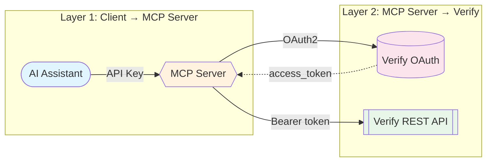

# Verify MCP Server

Let AI agents manage identity and access — provision users, configure SSO, enforce MFA policies, and audit authentication events through natural language.

## What You Can Do

- **Audit user access across your organization** — ask "who has admin access?" and get a complete inventory of privileged users, roles, and entitlements
- **Enforce MFA and authentication policies** — review and update multi-factor authentication requirements, passwordless configurations, and adaptive access rules
- **Automate user lifecycle management** — provision, deprovision, and modify user accounts across federated identity sources from a single conversation
- **Investigate authentication anomalies** — query login events, failed authentications, and suspicious activity patterns in real time

## Compatible With

IBM Bob · Claude Desktop · VS Code Copilot · watsonx Orchestrate · Any MCP-compatible AI assistant

---

## Architecture

```mermaid
flowchart TB
    A(["🤖 AI Assistant"])
    B{{"⚙️ Verify MCP Server"}}
    AUTH["🔐 OAuth2"]
    API["🌐 Verify REST API · 210 endpoints"]

    A -->|"MCP Protocol"| B
    B -->|"OAuth2 client_credentials"| AUTH
    AUTH -.->|"Bearer Token"| B
    B -->|"Authenticated Request"| API
    API -.->|"JSON Response"| B
    B -.->|"AI Response"| A
```

## Security

```mermaid
%%{init: {'theme': 'default'}}%%
flowchart LR
    subgraph "Layer 1: Client → MCP Server"
        A(["AI Assistant"]) -->|"API Key"| B{{"MCP Server"}}
    end

    subgraph "Layer 2: MCP Server → Verify"
        B -->|"OAuth2"| C[("Verify OAuth")]
        C -.->|"access_token"| B
        B -->|"Bearer token"| D[["Verify REST API"]]
    end

    style A fill:#e1f5fe
    style B fill:#fff3e0
    style C fill:#fce4ec
    style D fill:#e8f5e9
```

---

## Contact

**Maintainer:** Anuj Shrivastava — AI Engineer, US Industry Market - Service Engineering

📧 [ashrivastava@ibm.com](mailto:ashrivastava@ibm.com)

For demos, integration help, or collaboration — reach out via email.

> **Disclaimer:** This is a Minimum Viable Product (MVP) for testing and demonstration purposes only. Not for production use. No warranty or support guarantees.

## IBM Public Repository Disclosure

All content in this repository including code has been provided by IBM under the associated open source software license and IBM is under no obligation to provide enhancements, updates, or support. IBM developers produced this code as an open source project (not as an IBM product), and IBM makes no assertions as to the level of quality nor security, and will not be maintaining this code going forward.
