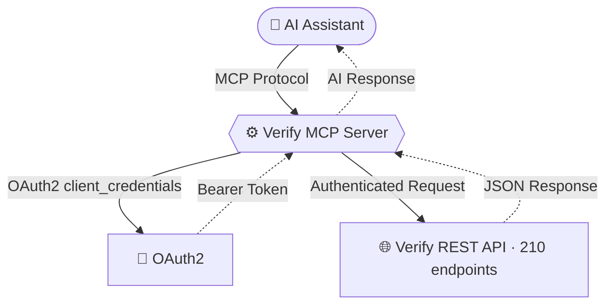
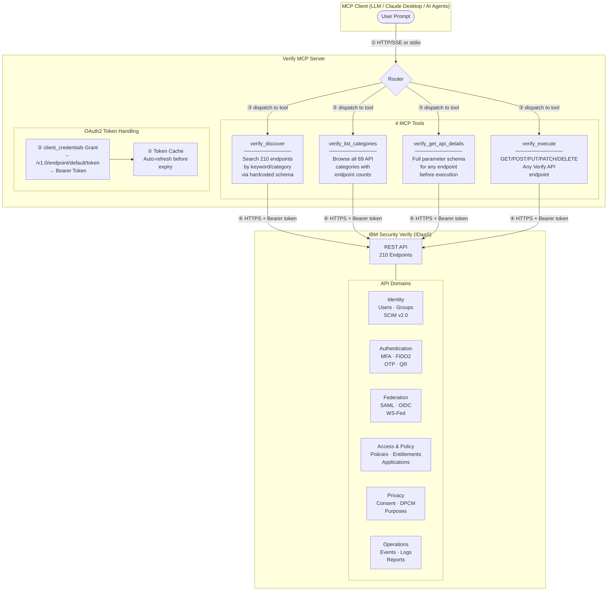
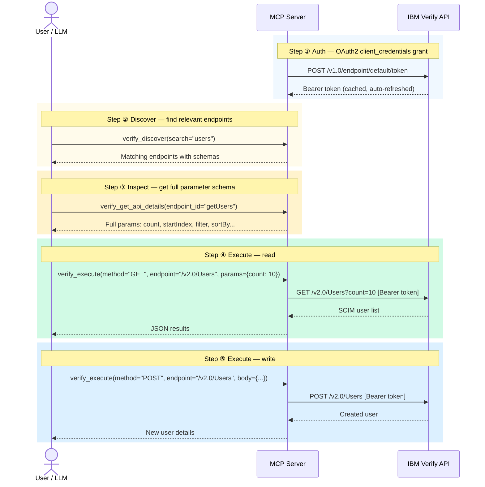
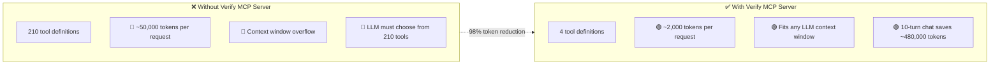

# Verify MCP Server

**Model Context Protocol (MCP) server for IBM Security Verify** — AI-driven access to 210+ IBM Security Verify REST APIs through 4 intelligent MCP tools.

[](LICENSE)
[](https://python.org)
[](https://modelcontextprotocol.io)

> **This is V2** — includes Prompts, Resources, Completions, Streamable HTTP, TLS, and Tool Annotations.
> See [V1 vs V2 Comparison](#v1-vs-v2-comparison) below.

---

## What is This?

Verify MCP Server bridges **Large Language Models (LLMs)** and **IBM Security Verify (IDaaS)**. Instead of exposing 210 API endpoints as separate tools (which would overwhelm any LLM context window), this server consolidates them into **4 intelligent tools** — achieving a **98% reduction** in token usage.

| Traditional Approach | Verify MCP Server |
|---------------------|-------------------|
| 210 tool definitions | **4 tool definitions** |
| ~50,000 tokens/request | **~500 tokens/request** |
| Context overflow risk | Fits any LLM context |
| All results returned | **Paginated (25/page), relevance-ranked** |

Works with any MCP-compatible client: Claude Desktop, VS Code, BOB, or custom AI agents.

---

## Architecture

### Overview


```mermaid
flowchart TB
    A(["🤖 AI Assistant"])
    B{{"⚙️ Verify MCP Server"}}
    AUTH["🔐 OAuth2"]
    API["🌐 Verify REST API · 210 endpoints"]
    A -->|"MCP Protocol"| B
    B -->|"OAuth2 client_credentials"| AUTH
    AUTH -.->|"Bearer Token"| B
    B -->|"Authenticated Request"| API
    API -.->|"JSON Response"| B
    B -.->|"AI Response"| A
```

### How It Works


```mermaid
flowchart TB
    subgraph CLIENT["MCP Client (LLM / Claude Desktop / AI Agents)"]
        U([User Prompt])
    end

    subgraph MCP["Verify MCP Server"]
        direction TB
        T{Router}

        subgraph TOOLS["4 MCP Tools"]
            direction LR
            T1["verify_discover\n─────────────\nSearch 210 endpoints\nby keyword/category\nvia hardcoded schema"]
            T2["verify_list_categories\n─────────────\nBrowse all 89 API\ncategories with\nendpoint counts"]
            T3["verify_get_api_details\n─────────────\nFull parameter schema\nfor any endpoint\nbefore execution"]
            T4["verify_execute\n─────────────\nGET/POST/PUT/PATCH/DELETE\nAny Verify API\nendpoint"]
        end

        subgraph AUTH["OAuth2 Token Handling"]
            direction LR
            CC["② client_credentials Grant\n→ /v1.0/endpoint/default/token\n→ Bearer Token"]
            CACHE["② Token Cache\nAuto-refresh before\nexpiry"]
        end

        CC --> CACHE
    end

    subgraph VERIFY["IBM Security Verify (IDaaS)"]
        API["REST API\n210 Endpoints"]
        subgraph CATEGORIES["API Domains"]
            direction LR
            C1["Identity\nUsers · Groups\nSCIM v2.0"]
            C2["Authentication\nMFA · FIDO2\nOTP · QR"]
            C3["Federation\nSAML · OIDC\nWS-Fed"]
            C4["Access & Policy\nPolicies · Entitlements\nApplications"]
            C5["Privacy\nConsent · DPCM\nPurposes"]
            C6["Operations\nEvents · Logs\nReports"]
        end
    end

    U -->|"① HTTP/SSE or stdio"| T
    T -->|"③ dispatch to tool"| T1 & T2 & T3 & T4
    T1 & T2 & T3 & T4 -->|"④ HTTPS + Bearer token"| API
    API --- CATEGORIES
```

### Tool Workflow


```mermaid
sequenceDiagram
    actor User as User / LLM
    participant MCP as MCP Server
    participant Verify as IBM Verify API

    rect rgb(240, 248, 255)
        Note over MCP,Verify: Step ①  Auth — OAuth2 client_credentials grant
        MCP->>Verify: POST /v1.0/endpoint/default/token
        Verify-->>MCP: Bearer token (cached, auto-refreshed)
    end

    rect rgb(255, 251, 235)
        Note over User,MCP: Step ②  Discover — find relevant endpoints
        User->>MCP: verify_discover(search="users")
        MCP-->>User: Matching endpoints with schemas
    end

    rect rgb(255, 243, 205)
        Note over User,MCP: Step ③  Inspect — get full parameter schema
        User->>MCP: verify_get_api_details(endpoint_id="getUsers")
        MCP-->>User: Full params: count, startIndex, filter, sortBy...
    end

    rect rgb(209, 250, 229)
        Note over User,Verify: Step ④  Execute — read
        User->>MCP: verify_execute(method="GET", endpoint="/v2.0/Users", params={count: 10})
        MCP->>Verify: GET /v2.0/Users?count=10 [Bearer token]
        Verify-->>MCP: SCIM user list
        MCP-->>User: JSON results
    end

    rect rgb(220, 240, 255)
        Note over User,Verify: Step ⑤  Execute — write
        User->>MCP: verify_execute(method="POST", endpoint="/v2.0/Users", body={...})
        MCP->>Verify: POST /v2.0/Users [Bearer token]
        Verify-->>MCP: Created user
        MCP-->>User: New user details
    end
```

### Token Efficiency


```mermaid
graph LR
    subgraph NAIVE["❌ Without Verify MCP Server"]
        direction TB
        NA["210 tool definitions"]
        NB["🔴 ~50,000 tokens per request"]
        NC["🔴 Context window overflow"]
        ND["🔴 LLM must choose from 210 tools"]
    end

    subgraph META["✅ With Verify MCP Server"]
        direction TB
        MA["4 tool definitions"]
        MB["🟢 ~2,000 tokens per request"]
        MC["🟢 Fits any LLM context window"]
        MD["🟢 10-turn chat saves ~480,000 tokens"]
    end

    NAIVE -.->|"98% token reduction"| META
```

---

## Security

Two-layer security model — all traffic is authenticated end-to-end.


```mermaid
%%{init: {'theme': 'default'}}%%
flowchart LR
    subgraph "Layer 1: Client → MCP Server"
        A(["AI Assistant"]) -->|"API Key"| B{{"MCP Server"}}
    end
    subgraph "Layer 2: MCP Server → Verify"
        B -->|"OAuth2"| C[("Verify OAuth")]
        C -.->|"access_token"| B
        B -->|"Bearer token"| D[["Verify REST API"]]
    end
    style A fill:#e1f5fe
    style B fill:#fff3e0
    style C fill:#fce4ec
    style D fill:#e8f5e9
```

---

## What You Can Do

- **Audit user access across your organization** — ask "who has admin access?" and get a complete inventory of privileged users, roles, and entitlements
- **Enforce MFA and authentication policies** — review and update multi-factor authentication requirements, passwordless configurations, and adaptive access rules
- **Automate user lifecycle management** — provision, deprovision, and modify user accounts across federated identity sources from a single conversation
- **Investigate authentication anomalies** — query login events, failed authentications, and suspicious activity patterns in real time

## Compatible With

IBM Bob · Claude Desktop · VS Code Copilot · watsonx Orchestrate · Any MCP-compatible AI assistant

---

## V1 vs V2 Comparison

| Feature | What you can do with MCP + IBM Verify | V1 | V2 |
|---------|---------------------------------------|:---:|:---:|
| **4 MCP Tools** | Ask the AI to list users, reset MFA, create groups, manage policies, query audit logs, or any of 210 Verify API operations in plain language — no API docs needed | ✅ | ✅ |
| **SSE Transport** | Connect any remote MCP client (Claude Desktop, VS Code, BOB) to a running server over HTTP/SSE — no local install required | ✅ | ✅ |
| **stdio Transport** | Run the server as a local subprocess — no network port, zero config for single-user desktop use | ✅ | ✅ |
| **Keystore Auth** | Secure the server with per-user API keys; generate, list, and revoke keys via `/admin/keys` without restarting | ✅ | ✅ |
| **Docker / K3s** | Ship as a container — run on any server, Kubernetes cluster, or K3s node; mount `/data` volume for key persistence | ✅ | ✅ |
| **Streamable HTTP** | Deploy stateless instances behind a load balancer; each request is self-contained — enables horizontal scaling and serverless | — | ✅ |
| **6 Prompt Templates** | Ask the AI "run a User Access Review for last 30 days" or "generate MFA enrollment report" and get a fully structured, data-driven report automatically | — | ✅ |
| **4 MCP Resources** | Expose live Verify data as readable resources — AI clients can browse API categories, inspect endpoint schemas, check tenant status, or read server info without calling a tool | — | ✅ |
| **Auto-Completions** | Get type-ahead suggestions for endpoint IDs, categories, HTTP methods, and compliance frameworks when typing tool arguments in supporting clients (VS Code, etc.) | — | ✅ |
| **Tool Annotations** | AI clients know upfront which tools are read-only (safe to call freely) vs. destructive (require confirmation) — reduces accidental writes | — | ✅ |
| **Progress Notifications** | See real-time progress updates during long-running Verify API calls — AI client is notified of intermediate steps, not just the final result | — | ✅ |
| **MCP Logging** | Server-side log events (INFO, WARNING, ERROR) are forwarded to the MCP client in real time — visible in the AI tool's log pane for live debugging | — | ✅ |
| **TLS Support** | Serve over HTTPS with a self-signed or CA-signed certificate — required for production deployments and zero-trust network policies | — | ✅ |

### V2-Only Components

| Component | Count | What it does |
|-----------|------:|-------------|
| **Prompts** | 6 | Pre-built report templates: `user_access_review`, `mfa_enrollment_report`, `federation_health_report`, `consent_compliance_report`, `threat_detection_report`, `application_onboarding_guide` |
| **Resources** | 4 | Live data surfaces: `verify://categories`, `verify://endpoints/{id}`, `verify://server/info`, `verify://tenant` |
| **Completions** | — | Auto-complete for `endpoint_id`, `category`, `method`, `framework`, `sso_protocol` |

---

## Available Tools

| Tool | Description | Use For |
|------|-------------|---------|
| `verify_discover` | Search endpoints by keyword or category | Find the right API — returns max 25 results, relevance-ranked. ≤3 matches auto-include full details. |
| `verify_list_categories` | List all 89 API categories grouped by domain | Browse the full API surface by domain (Identity, MFA, Federation, etc.) |
| `verify_get_api_details` | Get full parameter schema for a specific endpoint | Understand required params before calling |
| `verify_execute` | Execute any Verify API endpoint | GET, POST, PUT, PATCH, DELETE any resource |

### The 3-Step LLM Workflow

```
① verify_discover("users") → find endpoints
② verify_get_api_details("getUsers") → get parameter schema
③ verify_execute(GET, /v2.0/Users, {count: 10}) → actual data
```

After the first discovery, the LLM learns the pattern and stops calling discover — further reducing tokens in multi-turn conversations.

---

## Quick Start

### Prerequisites

- **Python 3.10+** or **Docker**
- **IBM Security Verify tenant** with API access
- **API Client credentials** (`client_id` + `client_secret`) with appropriate entitlements

### Option A: Docker (Recommended)

```bash
docker run -d \
  --name verify-mcp \
  -p 8004:8004 \
  -v verify-mcp-data:/data \
  -e VERIFY_TENANT="https://your-tenant.verify.ibm.com" \
  -e API_CLIENT_ID="your-api-client-id" \
  -e API_CLIENT_SECRET="your-api-client-secret" \
  -e MCP_TRANSPORT=sse \
  verify-mcp-server
```

### Option B: Python

```bash
# Clone
git clone https://github.ibm.com/ashrivastava/verify-mcp-server.git
cd verify-mcp-server
git checkout v2  # or main for v1

# Install
pip install -e .

# Configure
cat > .env << 'EOF'
VERIFY_TENANT=https://your-tenant.verify.ibm.com
API_CLIENT_ID=your-api-client-id
API_CLIENT_SECRET=your-api-client-secret
MCP_TRANSPORT=sse
MCP_PORT=8004
EOF

# Run
python -m src
```

### Verify it works

```bash
# Health check
curl http://localhost:8004/health

# Generate an API key (required for MCP client auth)
curl -X POST http://localhost:8004/admin/keys \
  -H "Content-Type: application/json" \
  -d '{"user": "admin@ibm.com"}'

# List keys
curl http://localhost:8004/admin/keys
```

---

## Configuration

### Environment Variables

| Variable | Required | Default | Description |
|----------|:--------:|---------|-------------|
| `VERIFY_TENANT` | Yes | — | Verify tenant URL (e.g., `https://mytenant.verify.ibm.com`) |
| `API_CLIENT_ID` | Yes | — | API client ID for `client_credentials` grant |
| `API_CLIENT_SECRET` | Yes | — | API client secret |
| `VERIFY_SSL` | No | `true` | Verify SSL certificates |
| `MCP_TRANSPORT` | No | `stdio` | Transport: `stdio`, `sse`, or `streamable-http` (v2) |
| `MCP_PORT` | No | `8004` | HTTP port for SSE / streamable-http |
| `LOG_LEVEL` | No | `INFO` | Logging level |
| `TLS_CERT` | No | — | Path to TLS certificate (v2) |
| `TLS_KEY` | No | — | Path to TLS private key (v2) |

### Transport Modes

| Mode | Flag / Env | Use Case | Version |
|------|-----------|----------|---------|
| **stdio** | `MCP_TRANSPORT=stdio` | Claude Desktop, VS Code (local) | v1, v2 |
| **SSE** | `MCP_TRANSPORT=sse` | Remote clients via HTTP/SSE | v1, v2 |
| **Streamable HTTP** | `MCP_TRANSPORT=streamable-http` | Stateless, scalable deployments | v2 only |

---

## API Key Management

All SSE/HTTP endpoints are protected by API key authentication via the keystore at `/data/keys.json`.

```bash
# Generate a new key
curl -X POST http://localhost:8004/admin/keys \
  -H "Content-Type: application/json" \
  -d '{"user": "bob@ibm.com"}'

# List all keys (prefix only)
curl http://localhost:8004/admin/keys

# Revoke a key by prefix
curl -X DELETE http://localhost:8004/admin/keys/<PREFIX>
```

Admin endpoints are **localhost-only** — they cannot be accessed remotely.

---

## API Coverage

### 89 Categories — 210 Endpoints — 9 Domains

| Domain | Categories | Example Operations |
|--------|-----------|-------------------|
| **Identity Management** | Users (SCIM v2.0), Groups, Dynamic Groups, User Self Care, Identity Sources | List/create/update/delete users, manage group membership, bulk operations |
| **Authentication & MFA** | OIDC, Password Auth, Email OTP, SMS OTP, TOTP, Voice OTP, FIDO2, QR Login, Knowledge Questions, Signature Auth, Authenticators | Enroll factors, verify OTP, manage FIDO registrations |
| **Federation** | SAML 2.0, WS-Federation, OIDC Federation, Social JWT Exchange | Manage federations, aliases, IdP attribute mappings |
| **Access & Policy** | Access Policies v5.0, Application Access, Entitlements, Access Requests | Create risk-based policies, manage application access |
| **Privacy & Consent** | Data Privacy Management, Consent Records, External Consent Providers | Create/update consent, manage purposes, data usage approval |
| **Configuration** | API Clients, OIDC Clients, Password Policies, Tenant Properties, Themes, Adapters | Manage API clients, rotate secrets, configure policies |
| **MFA Configuration** | Email/SMS/TOTP/Voice OTP Config, FIDO Config, QR Config, Authenticator Clients | Configure MFA methods, set OTP policies |
| **Operations** | Events, Reports, Query Logs, Webhooks, Threat Insights | Query audit logs, export reports, configure webhooks |
| **Governance** | Certification Campaigns v2.0 | Manage access certification campaigns |

---

## Project Structure

```
verify-mcp-server/
├── src/
│   ├── __init__.py
│   ├── __main__.py          # Entry point (python -m src)
│   ├── server.py            # MCP server, Starlette app, auth middleware
│   ├── tools.py             # 4 MCP tool definitions
│   ├── discovery.py         # API schema index (210 endpoints, 89 categories)
│   ├── client.py            # HTTP client for Verify API calls
│   ├── auth.py              # OAuth2 client_credentials token management
│   ├── config.py            # Environment-based configuration
│   ├── keystore.py          # API key generation, validation, revocation
│   ├── prompts.py           # 6 MCP prompt templates (v2)
│   ├── resources.py         # 4 MCP resources (v2)
│   └── completions.py       # MCP auto-completions (v2)
├── deploy/
│   └── deploy-appserver.sh  # Docker deployment script
├── tests/
│   ├── test_stdio.py        # stdio transport tests
│   └── test_sse_e2e.py      # SSE end-to-end tests
├── Dockerfile
├── pyproject.toml
├── run.py                   # WXO entry point (stdio mode)
├── SOLUTION_GUIDE.md        # Detailed solution walkthrough
├── CONTRIBUTING.md
├── SECURITY.md
└── LICENSE                  # Apache 2.0
```

---

## Version History

| Version | Date | Highlights |
|---------|------|------------|
| **2.0.0** | Apr 2026 | Streamable HTTP, MCP Prompts (6), Resources (4), Completions, Tool Annotations, TLS, Progress Notifications, MCP Logging |
| **1.0.0** | Mar 2026 | 4 meta-tools, 210 endpoints, SSE + stdio, keystore auth, Docker support |

---

## Contact

**Maintainer:** Anuj Shrivastava — AI Engineer, US Industry Market - Service Engineering  
📧 [ashrivastava@ibm.com](mailto:ashrivastava@ibm.com)  
For demos, integration help, or collaboration — reach out via email.

---

## IBM Public Repository Disclosure

All content in this repository including code has been provided by IBM under the associated open source software license and IBM is under no obligation to provide enhancements, updates, or support. IBM developers produced this code as an open source project (not as an IBM product), and IBM makes no assertions as to the level of quality nor security, and will not be maintaining this code going forward.
