# Verify MCP Server

**Model Context Protocol (MCP) server for IBM Security Verify** — AI-driven access to IBM Security Verify REST APIs through intelligent MCP tools.

---

## Architecture

### How It Works

```mermaid
flowchart TB
    subgraph CLIENT["MCP Client (LLM / Claude Desktop / AI Agents)"]
        U([User Prompt])
    end

    subgraph MCP["Verify MCP Server"]
        direction TB
        T{Router}

        subgraph TOOLS["4 MCP Tools"]
            direction LR
            T1["verify_discover\n─────────────\nSearch 210 endpoints\nby keyword/category\nvia hardcoded schema"]
            T2["verify_list_categories\n─────────────\nBrowse all 89 API\ncategories with\nendpoint counts"]
            T3["verify_get_api_details\n─────────────\nFull parameter schema\nfor any endpoint\nbefore execution"]
            T4["verify_execute\n─────────────\nGET/POST/PUT/PATCH/DELETE\nAny Verify API\nendpoint"]
        end

        subgraph AUTH["OAuth2 Token Handling"]
            direction LR
            CC["② client_credentials Grant\n→ /v1.0/endpoint/default/token\n→ Bearer Token"]
            CACHE["② Token Cache\nAuto-refresh before\nexpiry"]
        end

        CC --> CACHE
    end

    subgraph VERIFY["IBM Security Verify (IDaaS)"]
        API["REST API\n210 Endpoints"]
        subgraph CATEGORIES["API Domains"]
            direction LR
            C1["Identity\nUsers · Groups\nSCIM v2.0"]
            C2["Authentication\nMFA · FIDO2\nOTP · QR"]
            C3["Federation\nSAML · OIDC\nWS-Fed"]
            C4["Access & Policy\nPolicies · Entitlements\nApplications"]
            C5["Privacy\nConsent · DPCM\nPurposes"]
            C6["Operations\nEvents · Logs\nReports"]
        end
    end

    U -->|"① HTTP/SSE or stdio"| T
    T -->|"③ dispatch to tool"| T1 & T2 & T3 & T4
    T1 & T2 & T3 & T4 -->|"④ HTTPS + Bearer token"| API
    API --- CATEGORIES
```

### Tool Workflow

### Token Efficiency

```mermaid
graph LR
    subgraph NAIVE["❌ Without Verify MCP Server"]
        direction TB
        NA["210 tool definitions"]
        NB["🔴 ~50,000 tokens per request"]
        NC["🔴 Context window overflow"]
        ND["🔴 LLM must choose from 210 tools"]
    end

    subgraph META["✅ With Verify MCP Server"]
        direction TB
        MA["4 tool definitions"]
        MB["🟢 ~2,000 tokens per request"]
        MC["🟢 Fits any LLM context window"]
        MD["🟢 10-turn chat saves ~480,000 tokens"]
    end

    NAIVE -.->|"98% token reduction"| META
```

---

## Disclaimer

All content in this repository including code has been provided by IBM under the associated open source software license and IBM is under no obligation to provide enhancements, updates, or support. IBM developers produced this code as an open source project (not as an IBM product), and IBM makes no assertions as to the level of quality nor security, and will not be maintaining this code going forward.
