# Verify MCP Server

**Model Context Protocol (MCP) server for IBM Security Verify** — Access 210 IBM Verify REST API endpoints through just 4 intelligent MCP tools.

---

## What is This?

Verify MCP Server bridges **Large Language Models (LLMs)** and **IBM Security Verify (IDaaS)**. Instead of exposing 210 API endpoints as separate tools (which would overwhelm any LLM context window), this server consolidates them into **4 intelligent tools** — achieving a **98% reduction** in token usage.

| Traditional Approach | Verify MCP Server |
|---------------------|-------------------|
| 210 tool definitions | **4 tool definitions** |
| ~50,000 tokens/request | **~500 tokens/request** |
| Context overflow risk | Fits any LLM context |
| All results returned | **Paginated (25/page), relevance-ranked** |

Works with any MCP-compatible client: Claude Desktop, VS Code, custom AI agents, or direct HTTP calls.

---

## Quick Start

### Prerequisites

- **Docker** or **Podman** installed
- **IBM Security Verify tenant** with API access
- **API Client credentials** — create an API client in your Verify admin console with appropriate entitlements

### Step 1: Pull the Container

```bash
docker pull ghcr.io/ibm/verify-mcp-server:latest
```

> Currently built for **linux/amd64** (Intel/AMD). Apple Silicon users can run via Docker's built-in Rosetta emulation.

### Step 2: Run the Container

```bash
docker run -d \
  --name verify-mcp \
  -p 8004:8004 \
  -e VERIFY_TENANT="https://your-tenant.verify.ibm.com" \
  -e API_CLIENT_ID="your-api-client-id" \
  -e API_CLIENT_SECRET="your-api-client-secret" \
  ghcr.io/ibm/verify-mcp-server:latest
```

Replace:

- `your-tenant.verify.ibm.com` with your IBM Verify tenant URL
- `your-api-client-id` and `your-api-client-secret` with your API client credentials

### Step 3: Verify

```bash
curl http://localhost:8004/health
```

Expected response:

```json
{"status": "healthy", "mode": "http", "tools": 4, "categories": 89, "endpoints": 210}
```

That's it — the MCP server is running and ready to use.

---

## Using the MCP Server

### Available Tools

| Tool | Description | Use For |
|------|-------------|---------|
| `verify_discover` | Search endpoints by keyword or category | Find the right API — returns max 25 results, relevance-ranked. ≤3 matches auto-include full details. |
| `verify_list_categories` | List all 89 API categories grouped by domain | Browse the full API surface by domain (Identity, MFA, Federation, etc.) |
| `verify_get_api_details` | Get full parameter schema for a specific endpoint | Understand required params before calling |
| `verify_execute` | Execute any Verify API endpoint | GET, POST, PUT, PATCH, DELETE any resource |

### The 3-Step LLM Workflow

The LLM follows a **discover → inspect → execute** pattern:

```mermaid
flowchart LR
    S1["① verify_discover\n───────────\nsearch: 'users'\n→ matching endpoints"] --> S2["② verify_get_api_details\n───────────\nendpoint_id: getUsers\n→ full param schema"] --> S3["③ verify_execute\n───────────\nGET /v2.0/Users\n→ actual user data"]
    style S1 fill:#dbeafe,stroke:#3b82f6,color:#1e3a5f
    style S2 fill:#fef3c7,stroke:#f59e0b,color:#451a03
    style S3 fill:#d1fae5,stroke:#10b981,color:#064e3b
```



After the first discovery, the LLM **learns the pattern** and stops calling discover — further reducing tokens in multi-turn conversations.

> **Token Optimisations**: Results are relevance-ranked (exact match > word boundary > substring),
> paginated (max 25 per page with `offset`), and ≤3 matches auto-include full parameter
> details — eliminating extra tool calls. Multi-category results are grouped by domain for
> easier navigation.

### HTTP API Examples

**Discover endpoints:**

```bash
curl -X POST http://localhost:8004/tools/call \
  -H "Content-Type: application/json" \
  -d '{
    "name": "verify_discover",
    "arguments": {"search": "users"}
  }'
```

**List all API categories:**

```bash
curl -X POST http://localhost:8004/tools/call \
  -H "Content-Type: application/json" \
  -d '{
    "name": "verify_list_categories",
    "arguments": {}
  }'
```

**Get endpoint details:**

```bash
curl -X POST http://localhost:8004/tools/call \
  -H "Content-Type: application/json" \
  -d '{
    "name": "verify_get_api_details",
    "arguments": {"endpoint_id": "getUsers"}
  }'
```

**Execute an API call:**

```bash
curl -X POST http://localhost:8004/tools/call \
  -H "Content-Type: application/json" \
  -d '{
    "name": "verify_execute",
    "arguments": {
      "method": "GET",
      "endpoint": "/v2.0/Users",
      "params": {"count": 10}
    }
  }'
```

**List all tools:**

```bash
curl http://localhost:8004/tools
```

### With Claude Desktop (stdio Mode)

Add to your Claude Desktop MCP config (`~/Library/Application Support/Claude/claude_desktop_config.json`):

```json
{
  "mcpServers": {
    "verify": {
      "command": "docker",
      "args": [
        "run", "-i", "--rm",
        "-e", "VERIFY_TENANT=https://your-tenant.verify.ibm.com",
        "-e", "API_CLIENT_ID=your-api-client-id",
        "-e", "API_CLIENT_SECRET=your-api-client-secret",
        "ghcr.io/ibm/verify-mcp-server:latest",
        "--stdio"
      ]
    }
  }
}
```

Then ask things like:

- *"List all users in my Verify tenant"*
- *"Show me all MFA enrollment methods for user X"*
- *"What access policies are configured?"*
- *"Check the OIDC federation settings"*
- *"Show me recent audit events"*

---

## Configuration

### Environment Variables

| Variable | Required | Default | Description |
|----------|----------|---------|-------------|
| `VERIFY_TENANT` | Yes | — | Verify tenant URL (e.g., `https://mytenant.verify.ibm.com`) |
| `API_CLIENT_ID` | Yes | — | API client ID for client_credentials grant |
| `API_CLIENT_SECRET` | Yes | — | API client secret |
| `VERIFY_VERIFY_SSL` | No | `true` | Verify SSL certificates |

### Runtime Modes

| Mode | Flag | Use Case |
|------|------|----------|
| HTTP/SSE (default) | `--host 0.0.0.0 --port 8004` | Containers, web clients, direct API |
| stdio | `--stdio` | Claude Desktop, VS Code, local CLI tools |

---

## API Coverage

### 89 API Categories — 210 Endpoints

The Verify MCP Server covers the **complete** IBM Security Verify REST API surface:

| Domain | Categories | Example Operations |
|--------|-----------|-------------------|
| **Identity Management** | Users (SCIM v2.0), Groups, Dynamic Groups, User Self Care, Identity Sources | List/create/update/delete users, manage group membership, bulk operations |
| **Authentication & MFA** | OIDC, Password Auth, Email OTP, SMS OTP, TOTP, Voice OTP, FIDO2, QR Login, Knowledge Questions, Signature Auth, Authenticators | Enroll factors, verify OTP, manage FIDO registrations, session management |
| **Federation** | SAML 2.0, WS-Federation, OIDC Federation, Social JWT Exchange | Manage federations, aliases, IdP attribute mappings |
| **Access & Policy** | Access Policies v5.0, Application Access, Entitlements, Access Requests, Access Management | Create risk-based policies, manage application access, entitlement assignments |
| **Privacy & Consent (DPCM)** | Data Privacy Management, Consent Records, External Consent Providers, Data Subject Presentation | Create/update consent, manage purposes, data usage approval |
| **Configuration** | API Clients, OIDC Clients, Password Policies, Tenant Properties, Themes, Templates, Adapters, Provisioning | Manage API clients, rotate secrets, configure password policies |
| **MFA Configuration** | Email/SMS/TOTP/Voice OTP Config, FIDO Config, QR Config, Authenticator Clients, Signature Config, reCAPTCHA | Configure MFA methods, set OTP policies |
| **Operations & Monitoring** | Events, Reports, Query Logs, Webhooks, Threat Insights | Query audit logs, export reports, configure webhooks |
| **Governance** | Certification Campaigns v2.0 (configs, instances, assignments, statistics) | Manage access certification campaigns |
| **Other** | Certificates, Push Credentials, Email Suppression, Password Vault, Agent Bridge, Device Manager, Smartcard/X.509, Flow Management | Certificate management, push notification config, flow orchestration |

---

## Build from Source

```bash
git clone https://github.com/IBM/verify-mcp-server.git
cd verify-mcp-server

# Build container
docker build -t verify-mcp-server -f container/Dockerfile .

# Run
docker run -d --name verify-mcp -p 8004:8004 \
  -e VERIFY_TENANT="https://your-tenant.verify.ibm.com" \
  -e API_CLIENT_ID="your-api-client-id" \
  -e API_CLIENT_SECRET="your-api-client-secret" \
  verify-mcp-server
```

---

## Architecture

### How It Works

```mermaid
flowchart TB
    subgraph CLIENT["MCP Client (LLM / Claude Desktop / AI Agents)"]
        U([User Prompt])
    end

    subgraph MCP["Verify MCP Server"]
        direction TB
        T{Router}

        subgraph TOOLS["4 MCP Tools"]
            direction LR
            T1["verify_discover\n─────────────\nSearch 210 endpoints\nby keyword/category\nvia hardcoded schema"]
            T2["verify_list_categories\n─────────────\nBrowse all 89 API\ncategories with\nendpoint counts"]
            T3["verify_get_api_details\n─────────────\nFull parameter schema\nfor any endpoint\nbefore execution"]
            T4["verify_execute\n─────────────\nGET/POST/PUT/PATCH/DELETE\nAny Verify API\nendpoint"]
        end

        subgraph AUTH["OAuth2 Token Handling"]
            direction LR
            CC["② client_credentials Grant\n→ /v1.0/endpoint/default/token\n→ Bearer Token"]
            CACHE["② Token Cache\nAuto-refresh before\nexpiry"]
        end

        CC --> CACHE
    end

    subgraph VERIFY["IBM Security Verify (IDaaS)"]
        API["REST API\n210 Endpoints"]
        subgraph CATEGORIES["API Domains"]
            direction LR
            C1["Identity\nUsers · Groups\nSCIM v2.0"]
            C2["Authentication\nMFA · FIDO2\nOTP · QR"]
            C3["Federation\nSAML · OIDC\nWS-Fed"]
            C4["Access & Policy\nPolicies · Entitlements\nApplications"]
            C5["Privacy\nConsent · DPCM\nPurposes"]
            C6["Operations\nEvents · Logs\nReports"]
        end
    end

    U -->|"① HTTP/SSE or stdio"| T
    T -->|"③ dispatch to tool"| T1 & T2 & T3 & T4
    T1 & T2 & T3 & T4 -->|"④ HTTPS + Bearer token"| API
    API --- CATEGORIES
```



### Tool Workflow


### Token Efficiency

```mermaid
graph LR
    subgraph NAIVE["❌ Without Verify MCP Server"]
        direction TB
        NA["210 tool definitions"]
        NB["🔴 ~50,000 tokens per request"]
        NC["🔴 Context window overflow"]
        ND["🔴 LLM must choose from 210 tools"]
    end

    subgraph META["✅ With Verify MCP Server"]
        direction TB
        MA["4 tool definitions"]
        MB["🟢 ~2,000 tokens per request"]
        MC["🟢 Fits any LLM context window"]
        MD["🟢 10-turn chat saves ~480,000 tokens"]
    end

    NAIVE -.->|"98% token reduction"| META
```



In a **10-turn conversation**, this saves approximately **580,000 tokens** compared to the per-endpoint approach.

---

## Support

**Found a bug?**

- Open an issue at [github.com/IBM/verify-mcp-server/issues](https://github.com/IBM/verify-mcp-server/issues)
- Provide: steps to reproduce, environment details, and relevant logs
- Include log snippets: `docker logs verify-mcp`

**Need help?**

- Check container logs: `docker logs verify-mcp`
- Contact: [ashrivastava@in.ibm.com](mailto:ashrivastava@in.ibm.com), [Suraj.Kanth@ibm.com](mailto:Suraj.Kanth@ibm.com)

---

## Disclaimer

All content in this repository including code has been provided by IBM under the associated open source software license and IBM is under no obligation to provide enhancements, updates, or support. IBM developers produced this code as an open source project (not as an IBM product), and IBM makes no assertions as to the level of quality nor security, and will not be maintaining this code going forward.
