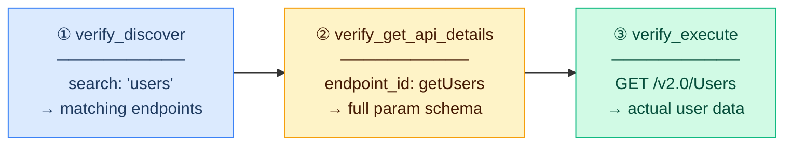
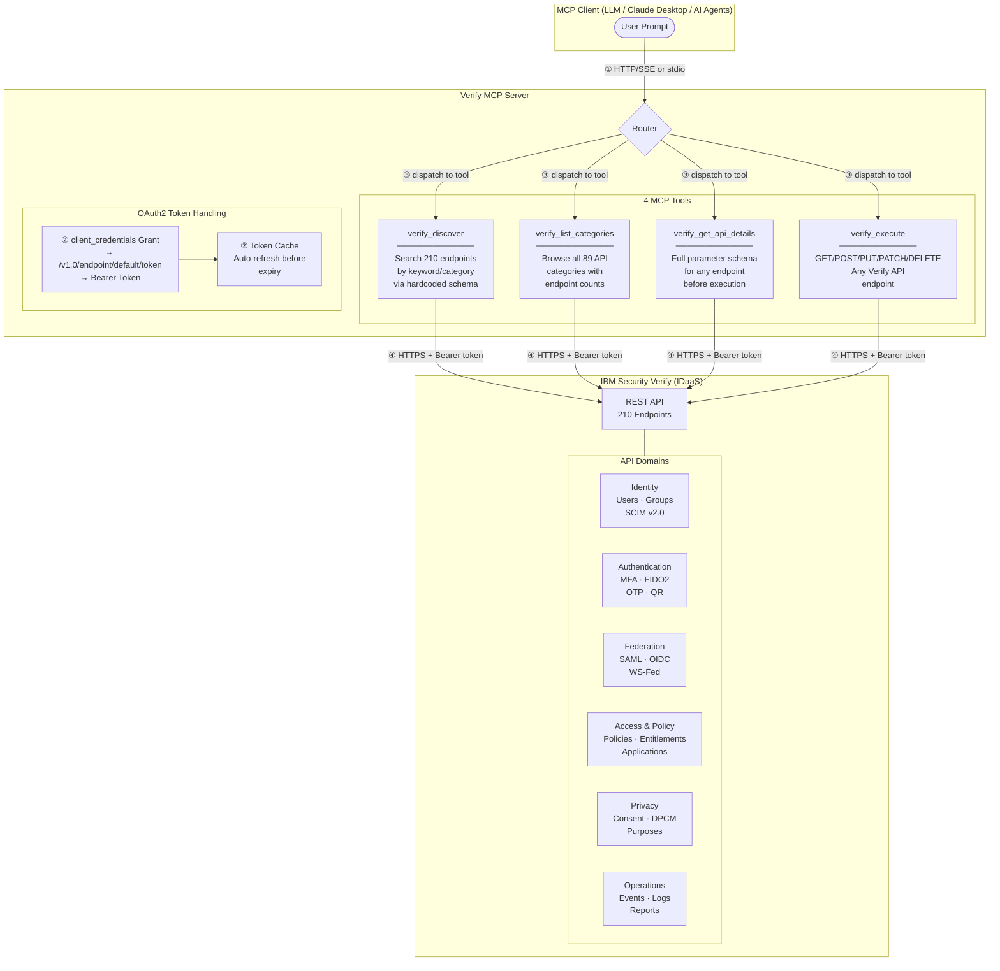
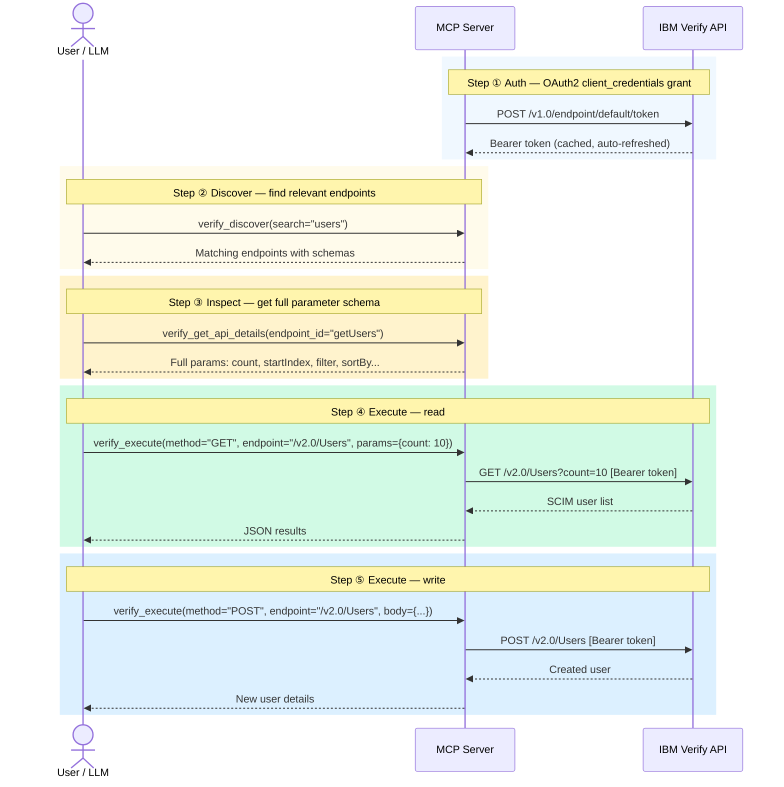
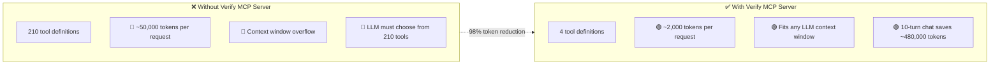

# Verify MCP Server — Solution Guide

**Model Context Protocol (MCP) server for IBM Security Verify** — Access 210 IBM Verify REST API endpoints through just 4 intelligent MCP tools.

---

## What is This?

Verify MCP Server bridges **Large Language Models (LLMs)** and **IBM Security Verify (IDaaS)**. Instead of exposing 210 API endpoints as separate tools (which would overwhelm any LLM context window), this server consolidates them into **4 intelligent tools** — achieving a **98% reduction** in token usage.

| Traditional Approach | Verify MCP Server |
|---------------------|-------------------|
| 210 tool definitions | **4 tool definitions** |
| ~50,000 tokens/request | **~500 tokens/request** |
| Context overflow risk | Fits any LLM context |
| All results returned | **Paginated (25/page), relevance-ranked** |

Works with any MCP-compatible client: Claude Desktop, VS Code, or custom AI agents.

---

## Available Tools

| Tool | Description | Use For |
|------|-------------|---------|
| `verify_discover` | Search endpoints by keyword or category | Find the right API — returns max 25 results, relevance-ranked. ≤3 matches auto-include full details. |
| `verify_list_categories` | List all 89 API categories grouped by domain | Browse the full API surface by domain (Identity, MFA, Federation, etc.) |
| `verify_get_api_details` | Get full parameter schema for a specific endpoint | Understand required params before calling |
| `verify_execute` | Execute any Verify API endpoint | GET, POST, PUT, PATCH, DELETE any resource |

---

## The 3-Step LLM Workflow

The LLM follows a **discover → inspect → execute** pattern:



After the first discovery, the LLM **learns the pattern** and stops calling discover — further reducing tokens in multi-turn conversations.

> **Token Optimisations**: Results are relevance-ranked (exact match > word boundary > substring),
> paginated (max 25 per page with `offset`), and ≤3 matches auto-include full parameter
> details — eliminating extra tool calls. Multi-category results are grouped by domain for
> easier navigation.

---

## HTTP API Examples

**Discover endpoints:**

```bash
curl -X POST http://localhost:8004/tools/call \
  -H "Content-Type: application/json" \
  -d '{
    "name": "verify_discover",
    "arguments": {"search": "users"}
  }'
```

**List all API categories:**

```bash
curl -X POST http://localhost:8004/tools/call \
  -H "Content-Type: application/json" \
  -d '{
    "name": "verify_list_categories",
    "arguments": {}
  }'
```

**Get endpoint details:**

```bash
curl -X POST http://localhost:8004/tools/call \
  -H "Content-Type: application/json" \
  -d '{
    "name": "verify_get_api_details",
    "arguments": {"endpoint_id": "getUsers"}
  }'
```

**Execute an API call:**

```bash
curl -X POST http://localhost:8004/tools/call \
  -H "Content-Type: application/json" \
  -d '{
    "name": "verify_execute",
    "arguments": {
      "method": "GET",
      "endpoint": "/v2.0/Users",
      "params": {"count": 10}
    }
  }'
```

**List all tools:**

```bash
curl http://localhost:8004/tools
```

---

## Configuration

### Environment Variables

| Variable | Required | Default | Description |
|----------|----------|---------|-------------|
| `VERIFY_TENANT` | Yes | — | Verify tenant URL (e.g., `https://mytenant.verify.ibm.com`) |
| `API_CLIENT_ID` | Yes | — | API client ID for client_credentials grant |
| `API_CLIENT_SECRET` | Yes | — | API client secret |
| `VERIFY_VERIFY_SSL` | No | `true` | Verify SSL certificates |

### Runtime Modes

| Mode | Flag | Use Case |
|------|------|----------|
| HTTP/SSE (default) | `--host 0.0.0.0 --port 8004` | Web clients, direct API calls |
| stdio | `--stdio` | Claude Desktop, VS Code, local CLI tools |

---

## API Coverage

### 89 API Categories — 210 Endpoints

The Verify MCP Server covers the **complete** IBM Security Verify REST API surface:

| Domain | Categories | Example Operations |
|--------|-----------|-------------------|
| **Identity Management** | Users (SCIM v2.0), Groups, Dynamic Groups, User Self Care, Identity Sources | List/create/update/delete users, manage group membership, bulk operations |
| **Authentication & MFA** | OIDC, Password Auth, Email OTP, SMS OTP, TOTP, Voice OTP, FIDO2, QR Login, Knowledge Questions, Signature Auth, Authenticators | Enroll factors, verify OTP, manage FIDO registrations, session management |
| **Federation** | SAML 2.0, WS-Federation, OIDC Federation, Social JWT Exchange | Manage federations, aliases, IdP attribute mappings |
| **Access & Policy** | Access Policies v5.0, Application Access, Entitlements, Access Requests, Access Management | Create risk-based policies, manage application access, entitlement assignments |
| **Privacy & Consent (DPCM)** | Data Privacy Management, Consent Records, External Consent Providers, Data Subject Presentation | Create/update consent, manage purposes, data usage approval |
| **Configuration** | API Clients, OIDC Clients, Password Policies, Tenant Properties, Themes, Templates, Adapters, Provisioning | Manage API clients, rotate secrets, configure password policies |
| **MFA Configuration** | Email/SMS/TOTP/Voice OTP Config, FIDO Config, QR Config, Authenticator Clients, Signature Config, reCAPTCHA | Configure MFA methods, set OTP policies |
| **Operations & Monitoring** | Events, Reports, Query Logs, Webhooks, Threat Insights | Query audit logs, export reports, configure webhooks |
| **Governance** | Certification Campaigns v2.0 (configs, instances, assignments, statistics) | Manage access certification campaigns |
| **Other** | Certificates, Push Credentials, Email Suppression, Password Vault, Agent Bridge, Device Manager, Smartcard/X.509, Flow Management | Certificate management, push notification config, flow orchestration |

---

## Architecture

### How It Works



### Tool Workflow



### Token Efficiency



In a **10-turn conversation**, this saves approximately **580,000 tokens** compared to the per-endpoint approach.
